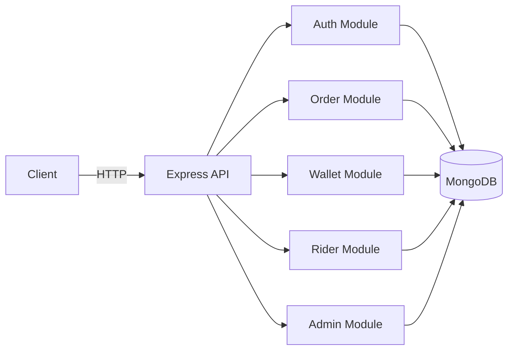

# Architecture Overview

```mermaid
flowchart LR
  Client -->|HTTP| API[Express API]
  API --> Auth[Auth Module]
  API --> Orders[Order Module]
  API --> Wallet[Wallet Module]
  API --> Rider[Rider Module]
  API --> Admin[Admin Module]

  Auth --> MongoDB[(MongoDB)]
  Orders --> MongoDB
  Wallet --> MongoDB
  Rider --> MongoDB
  Admin --> MongoDB
```
