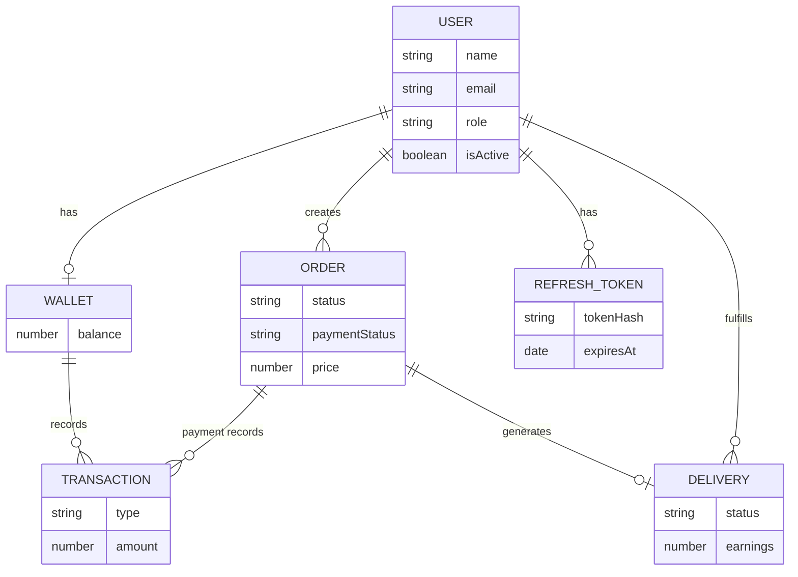

# ER Diagram

```mermaid
erDiagram
  USER ||--o| WALLET : has
  USER ||--o{ ORDER : creates
  USER ||--o{ DELIVERY : fulfills
  ORDER ||--o| DELIVERY : generates
  ORDER ||--o{ TRANSACTION : "payment records"
  WALLET ||--o{ TRANSACTION : records
  USER ||--o{ REFRESH_TOKEN : "has"

  USER {
    string name
    string email
    string role
    boolean isActive
  }

  WALLET {
    number balance
  }

  ORDER {
    string status
    string paymentStatus
    number price
  }

  DELIVERY {
    string status
    number earnings
  }

  TRANSACTION {
    string type
    number amount
  }

  REFRESH_TOKEN {
    string tokenHash
    date expiresAt
  }
```
